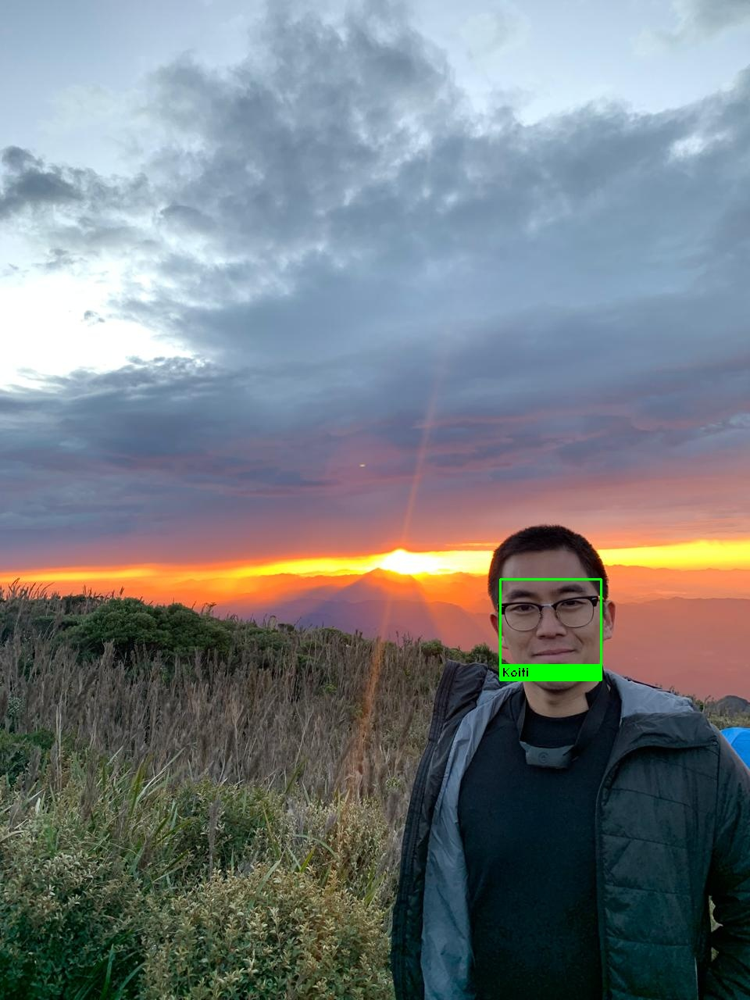

# 🧑‍💻 **Projeto de Cadastro e Reconhecimento Facial**

Este projeto utiliza técnicas avançadas de **processamento de imagens** e **visão computacional** para realizar o **cadastro e reconhecimento facial**. As faces são cadastradas através da extração de embeddings faciais de **128 dimensões** utilizando a biblioteca **dlib** (por meio do wrapper `face_recognition`). O sistema pode realizar reconhecimento facial tanto em imagens estáticas quanto em vídeo em tempo real pela webcam.

---

## 🎯 **Objetivo**
- Desenvolver uma rotina eficiente para **cadastrar rostos** utilizando embeddings extraídos por meio da biblioteca **dlib**.
- Aplicar métodos de reconhecimento facial precisos em imagens e transmissões em tempo real.

---

## 🛠 **Tecnologias e Ferramentas Usadas**
- **Linguagem:** Python
- **Bibliotecas:**
  - `face_recognition`: Extração e comparação de embeddings faciais.
  - `OpenCV`: Processamento de imagens e vídeo.
  - `NumPy`: Manipulação eficiente de dados numéricos.
  - `Jupyter Notebook`: Ambiente interativo para desenvolvimento.
  - `Conda`: Gerenciamento do ambiente de desenvolvimento.

---

## 📂 **Estrutura do Projeto**
### **Arquivos e Diretórios**
- **`face_registration_recognition.ipynb`**: Notebook principal contendo:
  - **Cadastro em lote (batch enrolment)** das faces, atualizando arquivo de embeddings.
  - **Cadastro individual** de uma nova face, preservando os dados anteriores.
  - **Reconhecimento facial** em imagens estáticas.
  - **Reconhecimento facial em tempo real** utilizando webcam.

- **Diretório `dataset_faces/`**:
  - Contém imagens organizadas por pastas, sendo cada pasta o nome da pessoa cadastrada.

```
.
├── dataset_faces/
├── face_registration_recognition.ipynb
├── environment.yml
└── README.md
```

**Nota**: Coloque as imagens das pessoas em `dataset_faces/<NomePessoa>/`. O nome da pasta será utilizado como o rótulo para o cadastro.

---

## 🧠 **Métodos Implementados**
- **Cadastro em lote (Batch enrolment)**:
  - Extrai embeddings de todas as imagens presentes nas pastas do diretório `dataset_faces` e salva em arquivo cumulativo `encodings.pickle`.

- **Cadastro Individual (Single-photo enrolment)**:
  - Permite adicionar novos rostos ao cadastro sem apagar informações anteriores, atualizando incrementalmente o arquivo de embeddings.

- **Reconhecimento facial em imagem estática**:
  - Identifica e etiqueta rostos presentes em imagens salvas, gerando arquivos `recognized*.jpg`.

- **Reconhecimento facial em tempo real**:
  - Realiza reconhecimento facial ao vivo via webcam, permitindo visualização imediata das faces identificadas (pressione `"q"` para sair).

---

## 📊 **Resultados Obtidos**
Durante os testes, o sistema demonstrou capacidade de cadastrar múltiplos indivíduos eficientemente e reconhecer rostos com alta precisão tanto em fotos quanto em tempo real pela webcam.

**Conclusão Geral**: As técnicas de extração e comparação de embeddings faciais usadas permitiram um reconhecimento facial robusto e confiável.

---

## 📷 **Exemplo de reconhecimento facial**
Abaixo está uma imagem ilustrativa demonstrando o reconhecimento facial:

### Imagem Exemplo Reconhecida


**Nota**: Use suas próprias imagens para testar o sistema, garantindo um cadastro prévio das pessoas.

---

## 🚀 **Próximos Passos**
- **Melhoria contínua da precisão**:
  - Ajustar parâmetros de detecção e reconhecimento para melhorar ainda mais a acurácia.
- **Interface Interativa**:
  - Desenvolver uma interface utilizando **Streamlit** para permitir uma interação mais amigável com o sistema de cadastro e reconhecimento facial.

---

## 👤 **Autor**
Guilherme Koiti Tanaka Sassaki  
[LinkedIn](https://www.linkedin.com/in/guilherme-sassaki-10b81ba7/)
